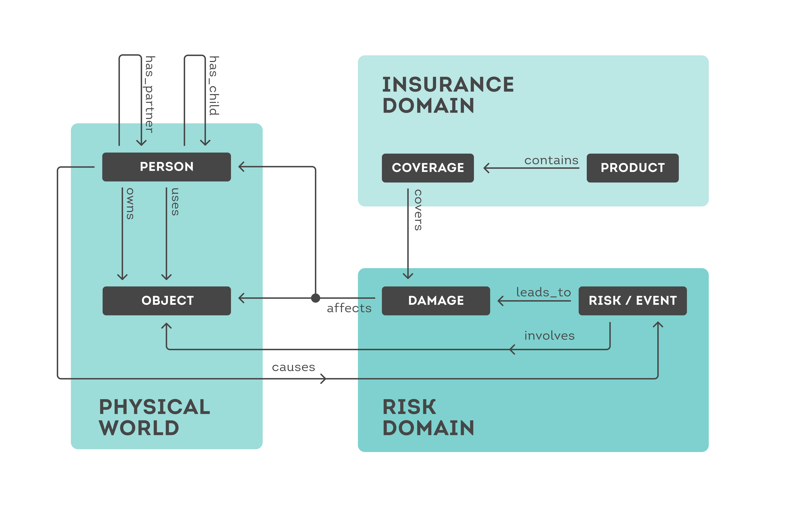

<!--
  Title: Global Insurance Ontology
  Description: Global, Lightweight, optimized for API, customer-centric, practical ontology for the insurance domain.
  Keywords: Global Insurance Ontology API data model json schema technology innovation ontologie versicherung versicherungstechnologie versicherungsinnovation
  -->

# Global Insurance Ontology

## Idea, Concept and Philosophy
The global insurance market is a huge data exchange ecosystem. To enable integration between players, many components need to be standardised, including data models, available services, and authentication flows. There are many standards in place that vary in scope, structure, age, and other characteristics. For example, many countries are using their own national data models. Meanwhile, existing players and new tech companies are pushing for innovation. Many of these initiatives are facing issues due to the following problems some of the existing standards have:

 - localized for national markets or specific providers
 - overly complex and difficult to handle
 - based on outdated technology

### The Global Insurance Ontology
In order to support developers, our initiative is focused on creating and continuously improving a set of schemas to model data in the insurance context. The main benefit of our schemas is that they can be used to model API resources, i.e. JSON data being exchanged in RESTful APIs. We aim to make our schemas

 - **global** - applicable in every country
 - **lightweight** and self-descriptive - easy to get started with
 - **optimized for API** usage and modern technologies
 - **customer-centric** - contains wishes, preferences and risks of the customer
 - **practical** - content validated against various existing APIs and standards

It is important to note: the idea is not to replace but to supplement local standards like [BiPRO](https://bipro.net), [OMDS](https://www.vvo.at/omds/index.html), EIAC, etc. since those commonly standardize various things like service structure and authentication flows as well. We intend to add a contribution and to drive innovation by making our work public.

## Content and Technical Structure
Our guiding principle for data modelling is **simplicity**. Highest-level classes and entities should be as close to the real world as possible. They should be intelligible in a broad context - and not overly technical or intelligible in very specific contexts only.

When thinking about insurance, people think of their belongings, health and risks, of future damages that could affect them. Ultimately, they think of how to mitigate those damages. So to create customer-centric services, the underlying data-model should also focus on these things. This is why we built our high-level model as follows:



*simplified model*

To make sure it is **complete**, the ontology has been validated against various existing APIs and standards. It is designed to serve as the common denominator underpinning all standards and models. This is particularly important given that the data flow involving insurance providers and other players needs to contain the necessary information to process requests and provide services - and each data model encodes information a bit differently. The schemas will be extended permanently to keep increasing completeness.

### Technical Structure
Our schemas are all [json-schemas](https://json-schema.org) structured in the following way.

Schemas are classified into 2 groups. Each of them are available in a full variant containing every possible field and a minimal variant containing only the most important fields. Minimal variants coming soon.
 - **core schemas**: These describe the high level classes in the ontology. These contain `$ref` references
 - **reference model schemas**: for now, for products. These bundle together parameters from various classes needed to describe an insurance situation. An insurance situation is a specific constellation of persons, owned and used objects, risks and damages affecting them, as well as products that are covering them. This way we can, for instance, express a generic accident insurance situation, including all the needed information but nothing more. These are self-contained and don't contain `$ref` references.

#### Parameter Modelling
To strike a balance between simplicity/practicality and expressiveness, parameters in the schemas are modeled exclusively by basic data types as described in the following table:

| type | additional formats | arrays thereof |
| --- | --- | --- |
| `string` | `date` | Yes |
| `integer` | - | Yes |
| `number` | `money` | No |
| `boolean` | - | No |

#### Json-Schema Definitions
Recurring definitions are factored out for reuse, e.g. money fields. Every schema includes all relevant definitions so that the schemas look like this:
```json
{
    "type": "object",
    "properties": {
        ...
    },
    "definitions": {
        ...
    }
}
```

For core schemas, all the definitions are in `definitions.json`. 

**Core Schemas** are found in `/schemas/core`. Example: `person.json` contains all properties to describe a person:

```json
{
    "type": "object",
    "properties": {
        "birthdate": {
            "description": "birthdate of the person",
            "type": "string",
            "format": "date"
        },
        "gender": {
            "description": "gender",
            "type": "string",
            "enum": [
                "m",
                "f",
                "o"
            ],
            "enum-description": [
                "male",
                "female",
                "other"
            ]
        },
        ...
    }
}
```

Note that the meta-tags `description` and `enum-description` are not part of standard json-schema - we added them to make schemas more self-descriptive. Json-schema is based on the tolerant reader principle, so that this data won't hurt any parsers or tools.

**Product reference model schemas** are found in `/schemas/products`. Note that the fields in these schemas are paths to the respective classes, containing the relationships between them. Actually, a product reference model schema is not strictly defining a class. It is a set of parameters needed to describe a complete situation involving many classes and relationships in an efficient way. Example: `accident.json` contains all parameters to describe an accident insurance situation, including information about the insured person, the included coverages, limits and deductibles.

```json
{
    "type": "object",
    "properties": {
        "person.birthdate": {
            "description": "birthdate of the person",
            "type": "string",
            "format": "date"
        },
        "person.gender": {
            "description": "gender",
            "type": "string",
            "enum": [
                "m",
                "f",
                "o"
            ],
            "enum-description": [
                "male",
                "female",
                "other"
            ]
        },
        "product.accident.coverage.accident-costs-and-medical-expenses.deductible": {
            "description": "deductible for given coverage(bundle) or product",
            "type": "number",
            "format": "money"
        },
        "product.accident.coverage.accident-costs-and-medical-expenses.is-included": {
            "description": "coverage is included in the product",
            "type": "boolean"
        },
        ...
    }
}
```

## Usage
Anyone can download our schemas and use them in their APIs, databases and more. Current users include [riskine (docs)](https://docs.riskine.com) and [koble (docs)](https://developers.koble.io/api-reference)

Since all of the schemas are json-schema, you can use the wealth of [json-schema utilities](https://json-schema.org/implementations.html) to get started - or build your own.

### Example 1: Generating Boilerplate
 - You want to create a python program to analyze accident insurance contracts from various providers
 - To get started as fast as possible, you want a readymade class completely describing any accident insurance contract out there, in which you can then import your various data and process in one interface
 - Generate a boilerplate class `AccidentInsurance` from the `accident.json` using [quicktype.io](https://app.quicktype.io?share=j0ykUfzlt3t5TtjIUNKl). You can, of course, omit fields from the schema as needed
 - Map data that you have into the class
 - Write your analysis algos against the class interface

### Example 2: As API resource in your OpenAPI 3 definition
 - You want to expose an API that handles accident insurance contracts described as simple, flat json objects
 - You want to use tooling around OpenAPI 3
 - Copypaste the `accident.json` into your OpenAPI 3 definition
 - You could be done here - bonus:
 - Create an analysis endpoint using the code from example 1 - it automatically works, since jsons adhering to the schema can be used to construct the `AccidentInsurance` class

## Contributing
Don't hesitate to reach out with feedback or input.

## Outlook
We will keep improving the existing schemas. At the same time, we are looking at ways to expand our offering into the following directions:

 1. Additional formats: Our core will always remain json-schema, however additional formats could be provided such as GraphQL schema, rdfs, json-ld, xsd, SQL schema, ...
 2. Domain additions: We will keep including additional insurance products, especially business lines
 3. Utilities

## Authors
The Global Insurance Ontology is created and maintained by [riskine.com](https://riskine.com) in co-creation with [koble.io](https://koble.io). Chief maintainers are riskine CTO [Johannes Seebacher](https://www.linkedin.com/in/johannes-seebacher-174b53109/) and [Bettina Ponleitner](https://www.linkedin.com/in/bettina-ponleitner-6a9701128/).